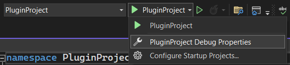
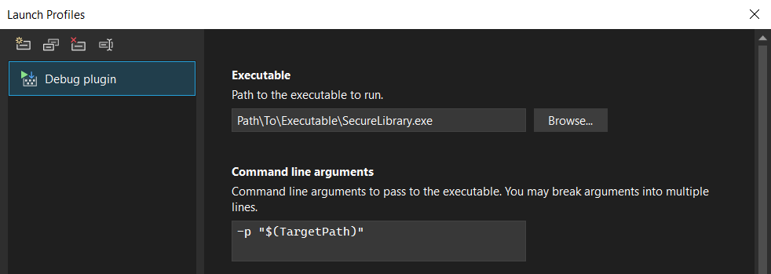
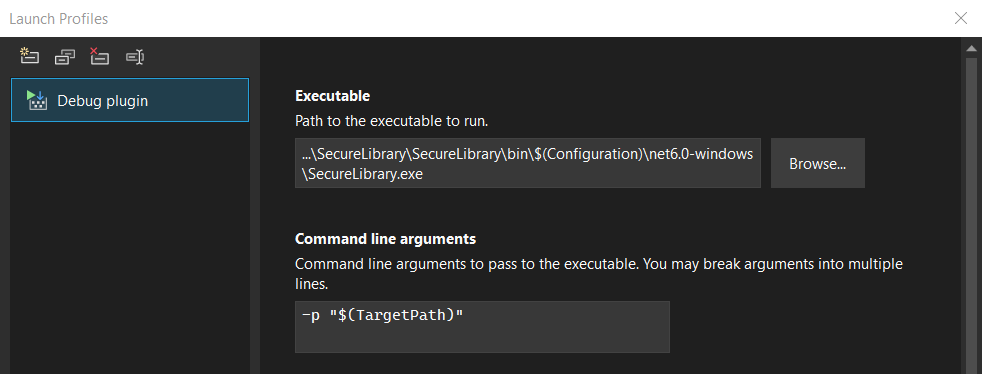

# Plugin development
## Secure Library API overview
### `SecureLibrary.Core.Library`
This class contains all information about current open library: root item and subitems, current container and storage method.

Property `Library.Resources` contains custom saveable and loadable plugin's data that is associated with whole library.

### `SecureLibrary.Core.LibraryItem`
Main hierarchical data storage class. Saves and loads data using `LibraryItem.ReadData(BinaryReader reader)` and `LibraryItem.WriteData(BinaryWriter writer)` methods.

Property `LibraryItem.Actions` contains actions for tree view context menu actions submenu.
Property `LibraryItem.UI` contains framework element for tab view.

### `SecureLibrary.Core.Storage.BinaryStorage`
Binary container for processed library data. Opens write or read stream using `BinaryStorage.OpenWrite()` and `BinaryStorage.OpenRead()` methods.

### `SecureLibrary.Core.Storage.Methods.StorageMethod`
Storage method for modification raw library data before writing in container. Wraps `BinaryStorage`'s stream using `StorageMethod.OpenWrite(BinaryStorage storage)` and `StorageMethod.OpenRead(BinaryStorage storage)` methods.

### `SecureLibrary.Core.Features.Feature`
It is base class for all features of Secure Library application. If class inherits `Feature` and has `SecureLibrary.Core.Features.RegisterFeatureAttribute` attribute, instance of it is created on program startup and added in `SecureLibrary.App.Features`. Then all features are initialized with `Feature.Init(App app)` method.

### `SecureLibrary.Core.Features.LibraryItems.LibraryItemFactory`
Creates library items based on user input using `LibraryItemFactory.Create()` method. All registered factories will be displayed in `Add` tree view context menu.

### `SecureLibrary.Core.Features.Storage.StorageFactoryContext`
Enumeration of avariable contexts of BinaryStorage or StorageMethod creation: `New`,  `Load` and `Save`.

### `SecureLibrary.Core.Features.Storage.BinaryStorageFactory`
Creates containers based on user input using `BinaryStorageFactory.Create(StorageFactoryContext context)` method or based on command line arguments using `BinaryStorageFactory.CreateFromArgs(string[] args)`. All registered factories will be displayed in `New`, `Load` and `Save` context menu.

### `SecureLibrary.Core.Features.Storage.Methods.StorageMethodFactory`
Creates storage methods based on user input using `BinaryStorageFactory.Create(StorageFactoryContext context)` method or based on command line arguments using `BinaryStorageFactory.CreateFromArgs(string[] args)`. All registered factories will be displayed in `New`, `Load` and `Save` context menu.

### `SecureLibrary.Windows.MainWindow.MenuButtons`
Property with collection of MainWindow top menu buttons.

## Creating plugin project
1. Create class library project with .NET 6.0 target framework
2. Pick Windows as target OS
3. Add SecureLibrary as project reference in dependencies
4. Set plugin as startup project
5. Open debug properties menu

	

7. Create executable profile, select `[Executable path]\SecureLibrary.exe` as `Executable` and enter `-p "$(TargetPath)"` in `Command line arguments` 

	

	- If you added SecureLibrary project in solution, you can enter `[Solution path]\SecureLibrary\bin\$(Configuration)\net6.0-windows\SecureLibrary.exe` in `Executable` to run SecureLibrary in different configurations

		
