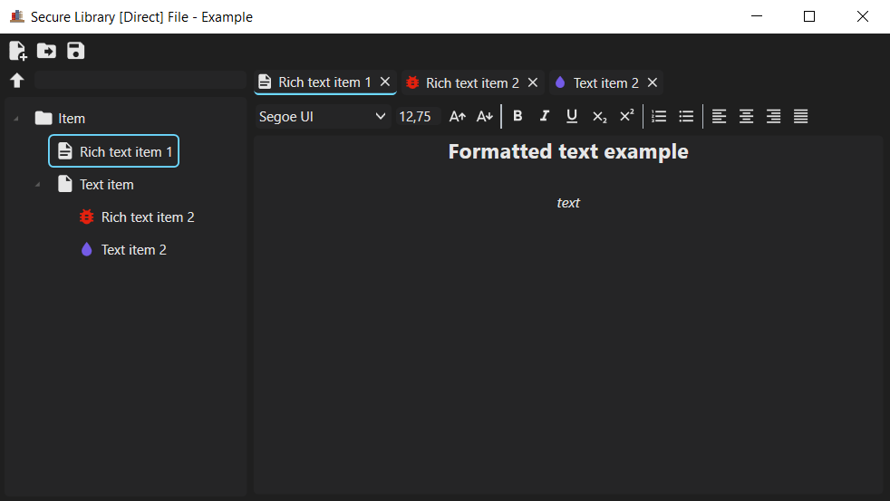
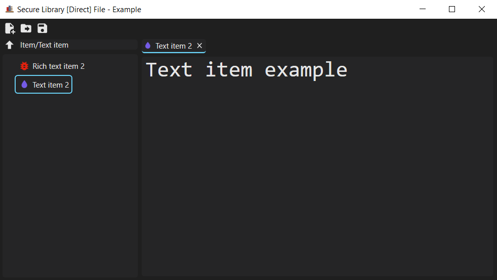
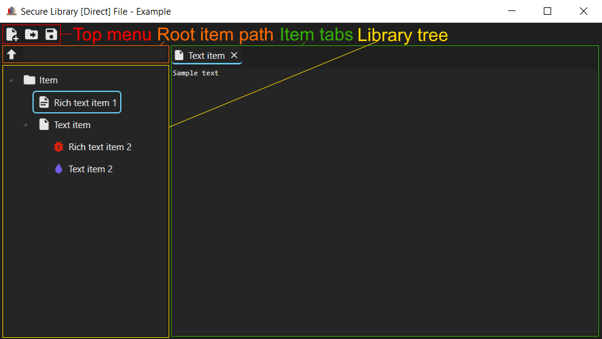
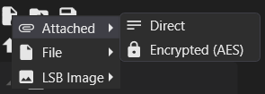
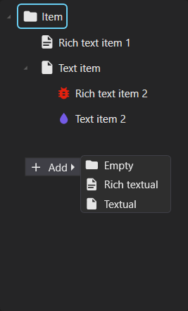
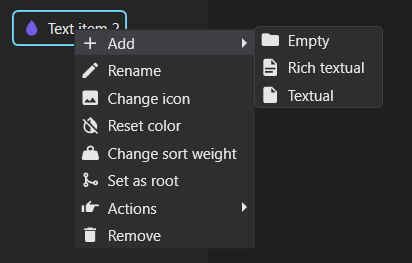
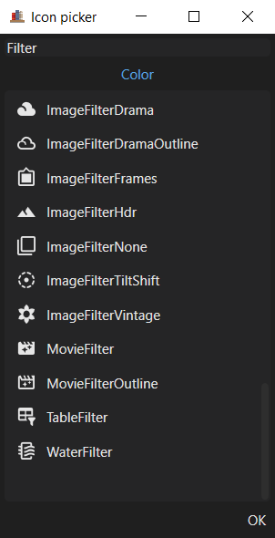
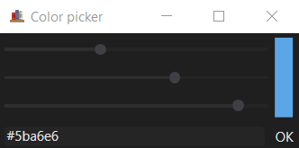

# Secure Library
Tool for storing hierarchical information in private way (encrypted and/or hidden)

## Screenshots


## Features
- Hierarchical storage
- Storing information in different containers
	- Separate file
	- Attached to file
	- Inside image (LSB Steganography)
- Optional password encryption
- Possibility of modification using plugins
	 - Easy to use modification API

## Interface overview

### Main window


- Top menu

	Contains New, Load and Save buttons.
- Library tree

	Tree view with all library items or with only subitems of item selected as root.
- Root item path

	If an item has been selected as root, path to that item in library is displayed.
- Item tabs

	Tab with item UI can be opened by double-clicking item in library tree view.

### New/Load/Save context menu


Can be opened by left-clicking New or Load buttons, or right clicking Save button if library is open.
First you pick the container type for library. Available container types:
- File
	
	Library data is stored in separate file.
- Attached
	
	Library data is stored at the end of the selected file. Works like a RAR file in RarJpeg files. For example, you can attach a library to a jpeg file and will be able to open the file in both a jpeg viewer and view the original contents of the file, and in the Secure Library program.
- LSB Image
	
	Library data is stored inside a PNG or BMP image using LSB steganography method. Storage space is limited to `Width · Height · 3` bytes. To avoid losing image quality, it is recommended to use large images and not take up more than `(Width · Height · 3) / 8` bytes.

Then you choose how to modify the library's binary data when saved to the container. Available methods:
- Direct
	
	Library data will not be modified and can be accessed without a password.
- Encrypted (AES)
	
	Library data will be encrypted with password using AES method.

### Tree context menu


Can be opened by right-clicking library tree view. Creates new library item at current root item. Available item types:
- Empty
	
	Contains no information, has no UI.
- Textual
	
	Contains plain text without formatting.
- Rich textual
	
	Contains text with formatting.

### Item context menu


Can be opened by right-clicking library item in tree view.
- Add
- Rename
- Change icon
	
	Opens icon picker dialog described below.
- Reset color
	
	Sets icon color back to default.
- Change sort weight.
	
	Changes float value that will be used in sorting items. By default empty item has `1` sort weight, the rest `0`.
- Set as root
	
	Selects item as tree view root.
- Actions
	
	Each library item type have individual actions. For example, textual item has `To rich` action, which converts it to rich textual item.
- Remove

### Icon picker


It has a filter field, a color selection button and a list with filtered icons.

### Color picker


Has three sliders for red, green and blue channels and field with color hexadecimal value.

## Plugins
The program directory has the following structure:
- `plugins`
	- `libraries`
- `SecureLibrary.exe`
- `...`

`plugins` directory contains Secure Library DLL plugins.
`libraries` directory contains .NET DLL library files, necessary for plugins to work.

## Command line arguments
- `--storage`, `-s`
	
	Picks library container to open.
	 - `-s file [filename]` - opens `File` container.
	 - `-s attached [filename]` - opens `Attached` container.
	 - `-s lsb [filename]` - opens `LSB Image` container.
 - `--method`, `-m`
	
	Picks a method for reading library data from container. If not used, the `Direct` method will be picked.
	- `-m aes` - opens password dialog and uses `Encrypted (AES)` method with password entered.
	- `-m aes [password]` - uses `Encrypted (AES)` method with provided password.
- `--library`, `-l`, `--dll`, `-d`
	
	Loads provided .NET DLL library file. Example: `-d System.Windows.Forms.dll`
- `--plugin`, `-p`
	
	Loads provided Secure Library plugin. Example: `-p SecureLibrary.ExamplePlugin.dll`

## Plugin development
See [Plugin development](PLUGINDEVELOPMENT.md)

## Build
1. Clone the repository.

```shell
$ git clone https://github.com/Scorodite/SecureLibrary.git
```

2. Open the repository in VS2022 and publish `SecureLibrary` project.

## Icons
Icons used in this program can be found on [Pictogrammers Material Design Icons Website](https://pictogrammers.com/library/mdi/)
